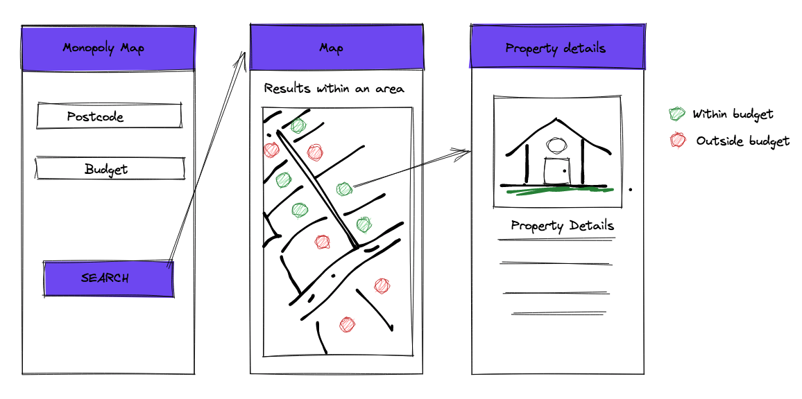
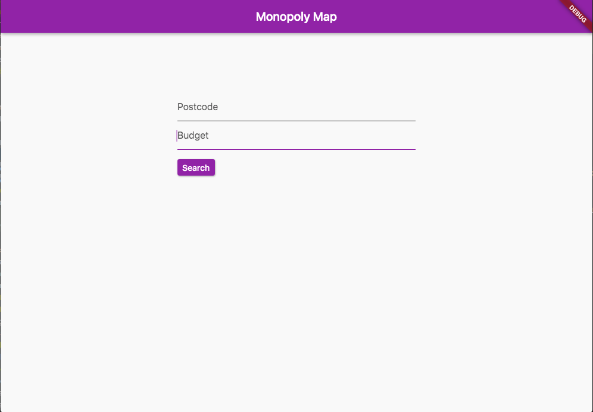
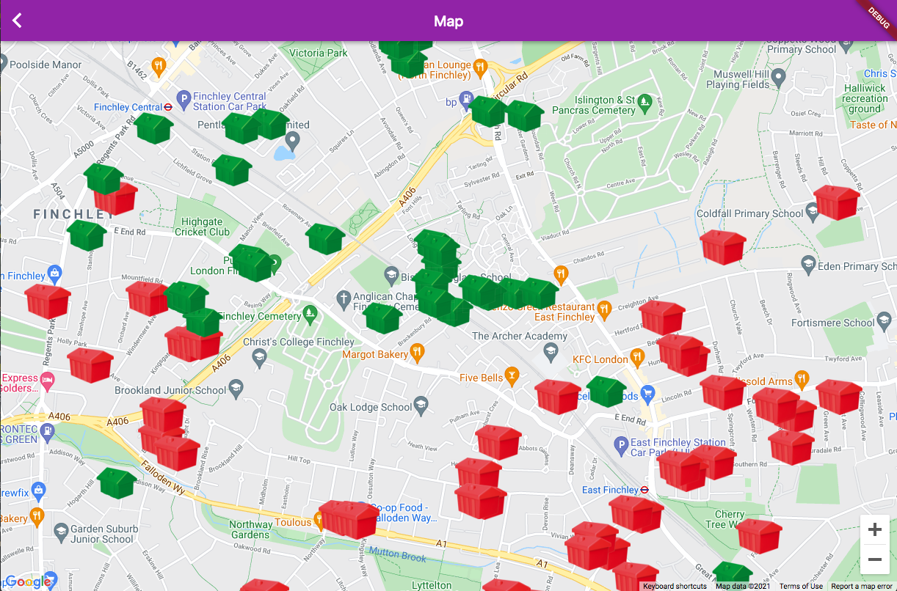
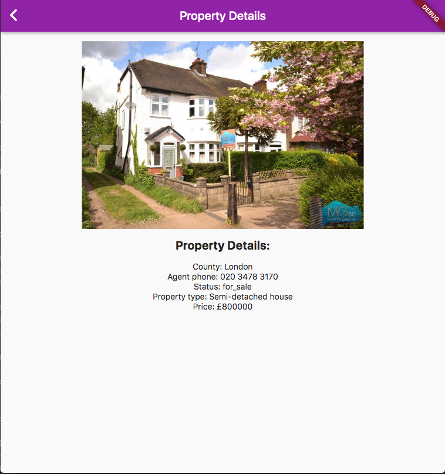

# Monopoly Map

Monopoly Map is an application that will search for house prices within an area based on your budget.
The results will be shown in google maps, each result will be show a monopoly house icon, green
or red. Where green will be the properties that are in your budget, and red properties outside your budget.

This application const of 3 pages as it is shown in the design.

## Application design



## Technologies used
* Dart: the entire app was created using Flutter.
* Postman: For the creation and testing of API calls.
* Package google_maps_flutter version ^2.0.6 for displaying Google Maps. 

## Description
Monopoly App uses 2 APIs: 
Zoopla API that retrieves a list of properties in a JSON format, the results are based on a postcode and a budget search. 
The results will be within a radius of 1 mile.
Maps JavaScript API to render the Google Maps and google_maps_flutter package to add customize Markers for each property position.

## APIs

### Zoopla API

In order to feed Monopoly Map with houses details, I am using Zoopla API, [here](https://developer.zoopla.co.uk/docs) 
you can find all the documentation.


#### API Endpoint
```sh
api/v1/property_listings.js
```

#### Request and Parameters
```sh
https://api.zoopla.co.uk/api/v1/property_listings.js?
```
| Parameter | value |
| ------ | ------ |
| listing_status | sale |
| postcode | value is inserted by the user |
| maximum_price | Maximum properties price |
| radius | 1 |
| page_size | 100, to cover a big list of properties |
| api_key | provided by Zoopla API |

#### Response
Note that this is a reduced example of a single response, several fields and descriptions have been deleted to make it
more readable and to give you an idea of the JSON file.

JSON
```json
{
    "country": "England",
    "result_count": 324,
    "longitude": -0.175976,
    "area_name": " N2",
    "listing": [
        {
            "country_code": "gb",
            "num_floors": 0,
            "image_150_113_url": "https://lid.zoocdn.com/150/113/24f1b03926554aa9f54eef91b8ad9af2d15bf2ed.jpg",
            "listing_status": "sale",
            ...
            "property_type": "Detached house",
            "letting_fees": "Tenant charges<br><br>ASTs<br>Holding deposits (per tenancy).... ",
            "longitude": -0.16,
            "floor_area": {
                "max_floor_area": {
                    "value": "10625",
                    "units": "sq_feet"
                },
                "min_floor_area": {
                    "value": "10625",
                    "units": "sq_feet"
                }
            },
            "thumbnail_url": "https://lid.zoocdn.com/80/60/24f1b03926554aa9f54eef91b8ad9af2d15bf2ed.jpg",
            "description": "A gated, double fronted detached house ...",
            "post_town": "London",
            ...
            "agent_phone": "020 8022 5635",
            "group_id": 94,
            "image_354_255_url": "https://lid.zoocdn.com/354/255/24f1b03926554aa9f54eef91b8ad9af2d15bf2ed.jpg",
            "image_url": "https://lid.zoocdn.com/354/255/24f1b03926554aa9f54eef91b8ad9af2d15bf2ed.jpg",
            "last_published_date": "2021-06-30 17:20:32"
        }
    ],
    "street": "",
    "radius": "1",
    "town": "",
    "latitude": 51.593415,
    "county": "London",
    "bounding_box": {
        "longitude_min": "-0.199247388067735",
        "latitude_min": "51.5789579330031",
        "longitude_max": "-0.152704611932265",
        "latitude_max": "51.6078720669969"
    },
    "postcode": "<postcode here>"
}
```

### Map JavaScript API

Before you start using the Maps JavaScript API, you need 
a project with a billing account and the Maps JavaScript API enabled. 
To learn more, see [Set up in Cloud Console](https://developers.google.com/maps/documentation/javascript/cloud-setup).


Maps JavaScript API needs latitude and longitude to render a position and Zoopla API provides all that information.

Also I found this Geolocation API for the UK [Postcodes.io](https://postcodes.io/).

#### API EndPoint
```sh
/api/js
```
#### Request and Parameters
```sh
https://maps.googleapis.com/maps/api/js?
```
| Parameter | value |
| ------ | ------ |
| key | Google Maps JavaScript API |

### Dart Files:
Monopoly Map contain the following dart files:

| File | Description |
| ------ | ------ |
| main.dart | Homepage and main page of the Monopoly map app |
| google_map_page.dart | 2nd page that display a map with monopoly house icons |
| property_details_page |3rd page of the app that shoes details of a selected property from the map|
| property_details | class model to store property details |

### Final Project screenshots

Home Page
---


Map Page
---


Details Page
---

 

