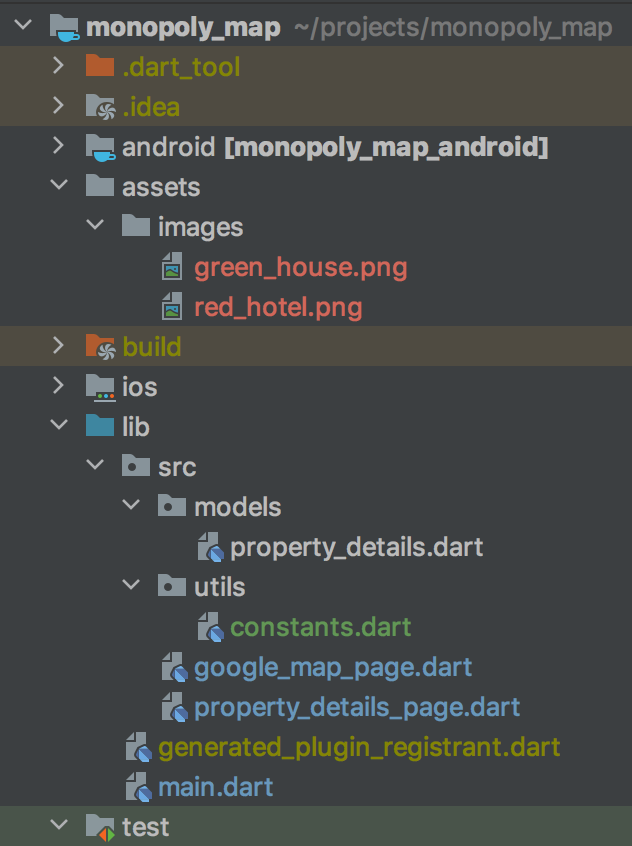

# Monopoly Map

Monopoly Map is an application that will search for house prices within an area based on your budget.
The results will be shown in google maps, each result will be assigned a monopoly house icon, green
or red. Where green will be the properties that are in your budget, and red properties outside your budget.

This application const of 3 pages as it is shown in the design.

### Application design


### Technologies used
* Dart, Flutter: the entire app was created using Flutter.
* Postman: For the creation and testing of API calls

-- ### Description

###APIs

#### Zoopla API Endpoint
In order to feed Monopoly Map with houses details, I am using Zoopla API, [here](https://developer.zoopla.co.uk/docs) you can find detailed information
about this API.

```sh
api/v1/property_listings.js
```

#### Request

```sh
https://api.zoopla.co.uk/api/v1/property_listings.js?
```

the parameters are added after the `?`:

| Parameter | value |
| ------ | ------ |
| listing_status | sale |
| postcode | value is inserted by the user |
| maximum_price | this is ... |
| radius | 1 |
| page_size | 100, to cover a big list of properties |
| api_key | provided by Zoopla API |

#### Response

JSON
---

```json

  <here goes the json>

```


#### Google Maps API Endpoint

```sh
/api/js
```

#### Request

```sh
https://maps.googleapis.com/maps/api/js?
```


| Parameter | value |
| ------ | ------ |
| key | Google Maps JavaScript API |

Note: To be able to use google maps you need to have a Google Cloud account
with billing details, Although you have a good free package, it is necessary otherwise
the map will have a label printed on it.

#### Response
JSON
---

```json

  <here goes the json from google maps>

```

### Dart Files:
Monopoly Map contain he following dart files:

{ width=50% }

| File | Description |
| ------ | ------ |
| main.dart | Homepage and main page of the Monopoly map app |
| google_map_page | 2nd page that display a map with monopoly houses icon |
| property_details_page |3rd page of the app that shoes details of a selected property from the map|
| property_details | class model to store property details |
| constanst.dart | stores values set directly |

Final Project: 

